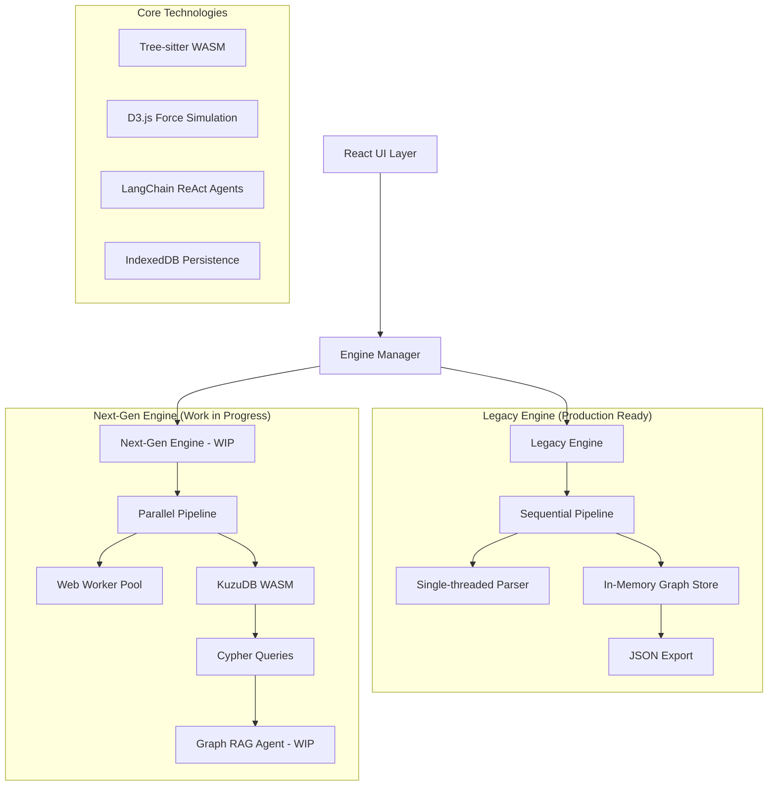
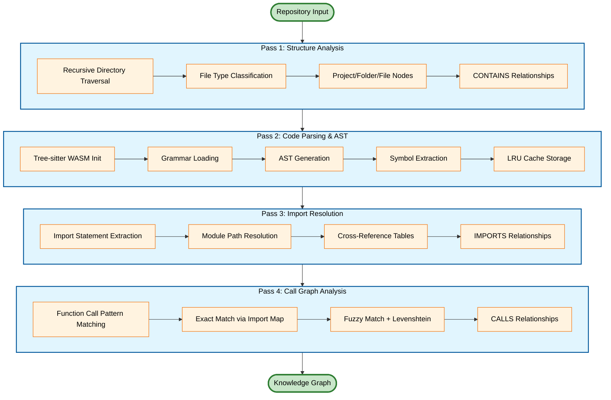
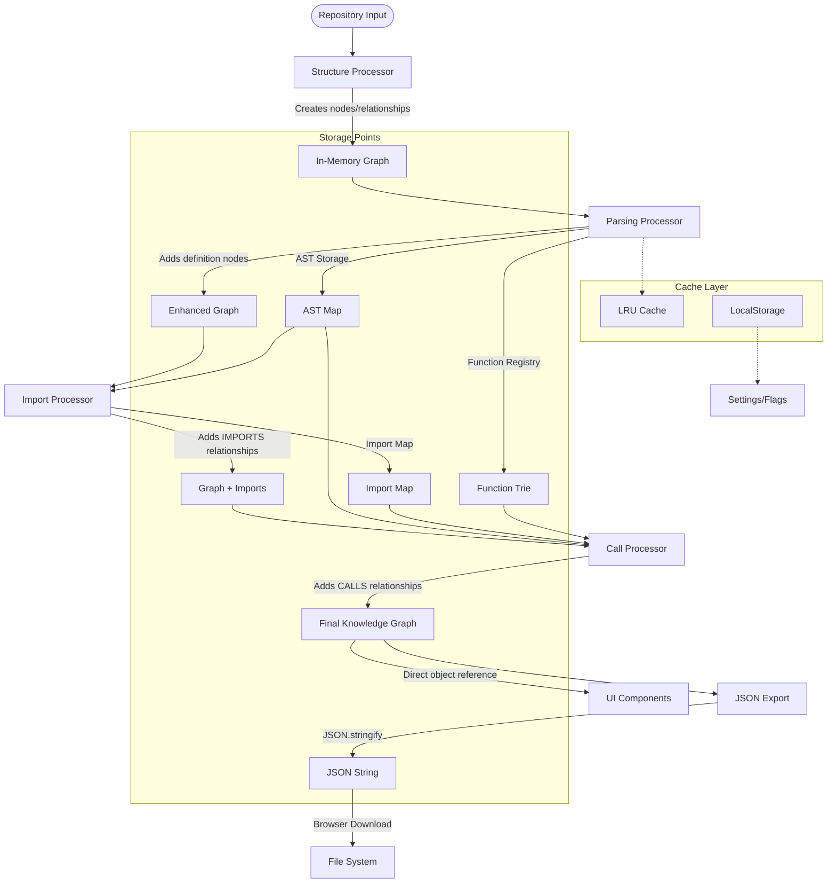
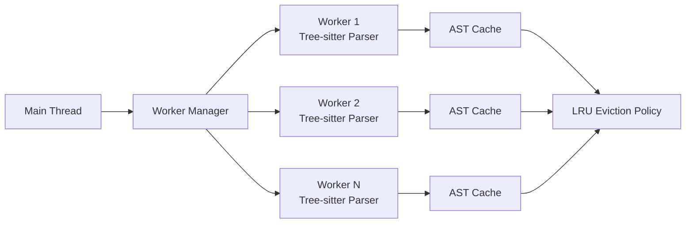
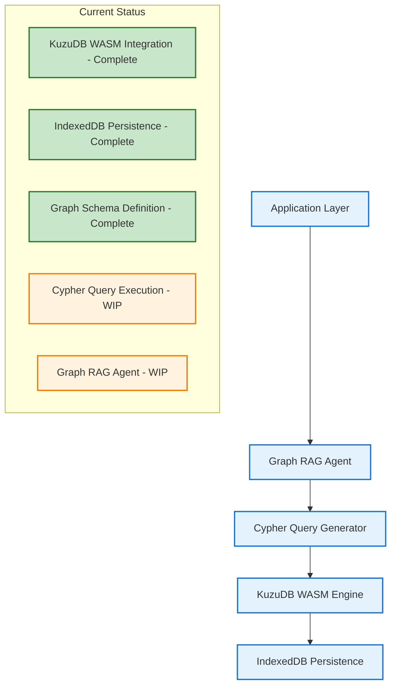

# GitNexus - Fully Client sided Knowledge Graph Generator and Graph RAG Agent


GitNexus is a privacy-focused, zero-server knowledge graph generator that runs entirely in your browser. It transforms codebases into interactive knowledge graphs using advanced AST parsing, multi-threaded Web Workers, and an embedded KuzuDB WASM database. Features a Graph RAG agent for intelligent code exploration through natural language queries using cypher queries executed directly against the in-browser graph database.

https://github.com/user-attachments/assets/6f13bd45-d6e9-4f4e-a360-ceb66f41c741

## Current Work in Progress:

Switch to bulk COPY into Kuzu DB from Batch writing. Should prevent Error ( RangeError: Maximum call stack size exceeded ) and should improve speed by about 50%, especially for large codebases


## Features

**Code Analysis**

- Analyze GitHub repositories or ZIP files
- Support for TypeScript, JavaScript, Python
- Interactive graph visualization with D3.js
- File filtering and directory selection
- Export results as JSON/CSV

**AI Chat**

- Multiple LLM providers (OpenAI, Anthropic, Gemini, Azure)
- Query code structure and relationships
- Context-aware conversations
- Graph-based code search

**Processing**

- Four-pass analysis: structure → parsing → imports → calls
- Parallel processing with Web Workers
- AST-based code extraction using Tree-sitter
- Memory-efficient caching

## Architecture



**Tech Stack**:

- **Frontend**: React 18 + TypeScript + Vite + D3.js force simulation
- **Parsing**: Tree-sitter WASM parsers (TypeScript, JavaScript, Python)
- **Concurrency**: Web Worker Pool with Comlink for thread-safe communication
- **Caching**: LRU-based AST cache with memory management and eviction policies
- **AI**: LangChain.js ReAct agents with tool-augmented reasoning
- **Database**: KuzuDB WASM integration (WIP) + IndexedDB persistence
- **Graph RAG**: Cypher query generation for knowledge graph reasoning (WIP)

## Four-Pass Ingestion Pipeline



### Data Flow & Storage Architecture



### Technical Implementation Details

**Pass 1: Structure Analysis**

- Implements recursive directory traversal with configurable depth limits
- File type detection using MIME types and extension mapping
- Creates hierarchical node structure with parent-child relationships
- Establishes CONTAINS relationships for project organization

**Pass 2: Code Parsing & AST Extraction**

- Initializes Tree-sitter WASM parsers with language-specific grammars
- Generates Abstract Syntax Trees for each source file
- Implements AST traversal algorithms to extract code symbols
- **LRU Cache System**: Memory-efficient AST storage with configurable eviction policies
- **Parallel Processing**: Web Worker Pool distributes parsing across multiple threads
- **Memory Management**: Automatic cleanup and garbage collection for large codebases

**Pass 3: Import Resolution**

- Extracts import/require statements using AST pattern matching
- Implements module resolution algorithms (Node.js, ES6, Python)
- Builds cross-reference tables for dependency mapping
- Handles relative/absolute path resolution with fallback strategies

**Pass 4: Call Graph Analysis**

- **Stage 1**: Exact function call matching using import resolution data
- **Stage 2**: Fuzzy matching with Levenshtein distance for unresolved calls
- **Stage 3**: Heuristic-based matching for dynamic calls and method chaining
- Creates CALLS relationships with confidence scoring

## Getting Started

**Prerequisites**: Node.js 18+, API keys for AI features

```bash
   git clone <repository-url>
   cd gitnexus
   npm install
   npm run dev
```

Open http://localhost:5173

**Configuration**

- GitHub token (optional): Increases rate limit to 5,000/hour
- AI API keys: OpenAI, Anthropic, Gemini, or Azure OpenAI
- Performance: Set file limits and directory filters

## Usage

**Analyze Repository**

1. Enter GitHub URL or upload ZIP file
2. Set filters (optional): directories, file patterns, size limits
3. Click "Analyze" and wait for processing
4. Explore the interactive graph

**AI Chat**

1. Configure API key in settings
2. Ask questions about the codebase:
   - "What functions are in main.py?"
   - "Show classes that inherit from BaseClass"
   - "How does authentication work?"

**Export Data**

- Click Export button to download graph as JSON/CSV

## Advanced Features & Work in Progress

### Web Worker Pool Architecture



### LRU Cache Implementation

- **Memory-bounded AST storage** with configurable size limits (default: 1000 entries)
- **Automatic eviction policies** based on access patterns and memory pressure
- **Thread-safe operations** across Web Worker boundaries using Comlink
- **Cache hit optimization** for repeated file analysis and import resolution
- **Garbage collection integration** with browser memory management APIs

### KuzuDB Integration Status (Work in Progress)



**Implementation Status**:

- ✅ **KuzuDB WASM Engine**: Fully integrated embedded graph database
- ✅ **Graph Schema**: Node and relationship type definitions implemented
- ✅ **Data Ingestion**: Knowledge graph storage in KuzuDB format
- 🚧 **Cypher Query Engine**: Query execution layer under development
- 🚧 **Graph RAG Agent**: AI agent with graph querying capabilities (blocked by Cypher integration)

**Current Limitation**: The Graph RAG agent cannot execute sophisticated graph queries because the Cypher query execution layer is still being implemented. Basic AI chat works with in-memory graph traversal, but advanced graph reasoning requires the KuzuDB Cypher integration to be completed.

### Dual-Engine Architecture

- **Legacy Engine**: Production-ready single-threaded processing with JSON storage
- **Next-Gen Engine**: Parallel processing with KuzuDB persistence (4-8x performance improvement)
- **Automatic Fallback**: System gracefully degrades to legacy engine if next-gen fails
- **Runtime Switching**: Users can toggle between engines without data loss

## Deployment

```bash
npm run build
npm run preview
```

**Environment Variables**

```env
VITE_OPENAI_API_KEY=sk-...
VITE_DEFAULT_MAX_FILES=500
VITE_ENABLE_DEBUG_LOGGING=false
```

## Security & Privacy

- All processing happens in your browser
- API keys stored locally, never transmitted
- No code or results stored remotely
- Uses GitHub public API only

## Contributing

1. Fork the repository
2. Create feature branch: `git checkout -b feature/name`
3. Make changes and test
4. Commit: `git commit -m 'Add feature'`
5. Push and open Pull Request

**Code Style**: TypeScript strict mode, ESLint rules, minimal comments

## License

MIT License - see [LICENSE](LICENSE) file

## Acknowledgments

- Tree-sitter for syntax parsing
- LangChain.js for AI agents
- D3.js for graph visualization
- KuzuDB for embedded database
- [code-graph-rag](https://github.com/vitali87/code-graph-rag) for reference implementation
