# GitNexus V2

**Zero-Server, Graph-Based Code Intelligence Engine**

> *Like DeepWiki, but deeper.* 😉

DeepWiki helps you *understand* code. GitNexus lets you *analyze* it—because a knowledge graph tracks every dependency, call chain, and relationship. 

That's the difference between:
- "What does this function do?" → *understanding*
- "What breaks if I change this function?" → *analysis*

**What you can do:**

| Capability | Description |
|------------|-------------|
| **Codebase-wide audits** | Find layer violations, forbidden dependencies |
| **Blast radius analysis** | See every function affected by a change |
| **Dead code detection** | Identify orphaned nodes with zero incoming calls |
| **Dependency tracing** | Follow import chains across the entire codebase |
| **AI analyses with citations** | Ask questions, analyze, get answers with `[[file:line]]` proof |

**100% client-side.** Your code never leaves your browser.

**Supports:** TypeScript, JavaScript, Python (Go, Java, C in progress)

https://github.com/user-attachments/assets/2fb7c522-20d1-48f6-9583-36c3969aa4dc

---

## 🤔 Why a Knowledge Graph?

Most coding tools use **grep**, **semantic search**, or at best **LSP**. Here's why that's not enough:

| Approach | What It Does | What It Misses |
|----------|--------------|----------------|
| **Grep** | Text matching | No understanding of code structure |
| **Semantic/Embeddings** | "Similar" code by meaning | Doesn't know what *calls* what |
| **LSP** | Jump-to-definition, references | Limited to current project, no cross-file call chains |

**The problem for AI coding tools:** When an LLM modifies code, it might not see the full blast radius. It edits `UserService.validate()` without knowing 47 other functions depend on its return type. Result: breaking changes.

**The knowledge graph solution:**


Unlike grep (text) or embeddings (similarity), a knowledge graph tracks **actual relationships**:
- Who **calls** this function?
- What **imports** this module?
- What **extends** this class?

This enables accurate **blast radius analysis** and **dependency auditing**—capabilities that grep-based or embedding-only tools simply can't provide.

---

## 🚀 Quick Start

```bash
git clone <repository-url>
cd gitnexus
npm install
npm run dev
```

Open http://localhost:5173, drag & drop a ZIP of your codebase, and start exploring.

---

## 🏗️ Indexing Architecture

Two-phase indexing: **Knowledge Graph** (blocking) → **Embeddings** (background).

### Phase 1-5: Knowledge Graph Creation


### Symbol Table: Dual HashMap

Resolution strategy for function calls:


**Data structure:**
```
File-Scoped: Map<FilePath, Map<SymbolName, NodeID>>
Global:      Map<SymbolName, SymbolDefinition[]>
```

### Phase 6+: Background Embeddings


User can explore the graph during embedding. AI features unlock when complete.

---

## 📊 Graph Schema

### Node Types

| Label | Description | Properties |
|-------|-------------|------------|
| `Folder` | Directory | `name`, `filePath` |
| `File` | Source file | `name`, `filePath`, `language` |
| `Function` | Function def | `name`, `filePath`, `startLine`, `endLine`, `isExported` |
| `Class` | Class def | `name`, `filePath`, `startLine`, `endLine` |
| `Interface` | Interface def | `name`, `filePath`, `startLine`, `endLine` |
| `Method` | Class method | `name`, `filePath`, `startLine`, `endLine` |
| `CodeElement` | Generic symbol | `name`, `filePath` |

### Relationship Table: `CodeRelation`

Single edge table with `type` property:

| Type | From | To | Description |
|------|------|-----|-------------|
| `CONTAINS` | Folder | File/Folder | Directory structure |
| `DEFINES` | File | Function/Class/etc | Code definitions |
| `IMPORTS` | File | File | Module dependencies |
| `CALLS` | Function/Method | Function/Method | Call graph |
| `EXTENDS` | Class | Class | Inheritance |
| `IMPLEMENTS` | Class | Interface | Interface implementation |

---

## 🛠️ Agent Tools Architecture

The LangChain ReAct agent has **5 tools** for code exploration. These tools **use the graph** built during indexing.

### Tool 1: `search` — Hybrid Search with Graph Context

Combines **BM25** (keyword) + **Semantic** (vector) + **1-hop expansion**:

```mermaid
flowchart TD
    Q[Query: auth middleware] --> BM25[BM25 Keyword Search]
    Q --> SEM[Semantic Vector Search]
    
    BM25 --> RRF[Reciprocal Rank Fusion]
    SEM --> RRF
    
    RRF --> TOP[Top K Results]
    TOP --> HOP[1-Hop Graph Expansion]
    
    HOP --> OUT["Each result includes:
    • ID, file, score
    • Incoming connections (who calls this)
    • Outgoing connections (what this calls)"]
```



**How 1-hop works:**
```cypher
MATCH (n {id: $nodeId})
OPTIONAL MATCH (n)-[r1:CodeRelation]->(dst)
OPTIONAL MATCH (src)-[r2:CodeRelation]->(n)
RETURN collect(dst.name), collect(src.name)
```

The agent sees not just *what matches*, but *what connects to it*.

---

### Tool 2: `cypher` — Raw Graph Queries with Auto-Embedding

Execute Cypher directly. If you include `{{QUERY_VECTOR}}`, it auto-embeds:


**Example with auto-embedding:**
```cypher
CALL QUERY_VECTOR_INDEX('CodeEmbedding', 'idx', {{QUERY_VECTOR}}, 10)
YIELD node, distance
WHERE distance < 0.4
MATCH (caller:Function)-[:CodeRelation {type: 'CALLS'}]->(n:Function {id: node.nodeId})
RETURN caller.name, n.name
```

The agent provides `query: "authentication"` → system embeds it → injects the vector.

---

### Tool 3: `grep` — Regex Pattern Matching

For exact strings, error codes, TODOs:

```mermaid
flowchart LR
    PAT[Pattern: TODO|FIXME] --> REGEX[Compile Regex]
    REGEX --> SCAN[Scan all files]
    SCAN --> MATCH[Match per line]
    MATCH --> RES["file:line: content"]
```

---

### Tool 4: `read` — Smart File Reader

Fuzzy path matching with suggestions:


---

### Tool 5: `highlight` — Visual Graph Feedback

Emits a marker that the UI parses to highlight nodes:
```
[HIGHLIGHT_NODES:Function:src/auth.ts:validate,Class:src/user.ts:UserService]
```

---

## 💡 Key Discovery: Unified Vector + Graph

Most Graph RAG systems use **separate databases**—vector DB for semantic search, graph DB for traversal.

KuzuDB supports **native vector indexing (HNSW)**, so we do both in **one Cypher query**:

```cypher
-- Semantic search + graph traversal in ONE query
CALL QUERY_VECTOR_INDEX('CodeEmbedding', 'code_embedding_idx', $queryVector, 20)
YIELD node AS emb, distance
WITH emb, distance WHERE distance < 0.4
MATCH (n:Function {id: emb.nodeId})<-[:CodeRelation {type: 'CALLS'}]-(caller:Function)
RETURN n.name, caller.name, distance
ORDER BY distance
```

**Why this matters:**
- 🎯 **Single query execution** — No round-trips between systems
- 📊 **Built-in relevance ranking** — Distance IS the score
- ⚡ **No separate vector DB** — One database, one query language
- 🌳 **LLM-friendly** — Agent writes one Cypher, gets semantic + structural results

---

## 🔬 Deep Dive: Copy-on-Write Memory Issue

Hit an interesting problem storing embeddings worth documenting.

**Setup:** Store 384-dim embeddings alongside code nodes.
```cypher
MATCH (n:CodeNode {id: $id}) SET n.embedding = $vec
```

**Problem:** Worked for ~20 nodes, exploded at ~1000:
```
Buffer manager exception: Unable to allocate memory!
```

**Root cause: Copy-on-Write.** Each `UPDATE` copies the entire record (~2KB of code content). 1000 updates = massive memory duplication in WASM.

```mermaid
flowchart LR
    subgraph COW["Copy-on-Write Effect"]
        OLD[Old: 2KB] --> NEW[New: 3.5KB]
    end
    COW -->|"× 1000 nodes"| BOOM[💥 Buffer Exhausted]
```



**Fix:** Separate `CodeEmbedding` table with `INSERT` only:


**Lesson:** In-memory WASM DBs have hard limits. Profile at scale, not happy path.

---

## ⚡ V2 Technical Improvements

### Sigma.js + WebGL
- V1: D3.js, choked at ~3k nodes
- V2: Sigma.js + GPU rendering, smooth at 10k+

### Dual HashMap Symbol Table
- V1: Trie (prefix tree) - clever but slow
- V2: File-scoped + Global hashmaps - **~2x speedup**

### LRU AST Cache
- Tree-sitter ASTs live in WASM memory
- LRU cache (50 slots) with `tree.delete()` for cleanup
- Memory stays bounded even for huge codebases

### ForceAtlas2 in Web Worker
- Layout algorithm runs off main thread
- UI stays responsive during graph positioning

---

## 🚧 Roadmap

### Actively Building

- [ ] **MCP Support** - Model Context Protocol for tool extensibility
- [ ] **External DB Support** - Connect to Neo4j (hosted or Docker)
- [ ] **Blast Radius Analysis Tool** - Dedicated UI for impact analysis
- [ ] **Multi-Worker Pool** - Parallel parsing across Web Workers
- [ ] **Ollama Support** - Local LLM integration
- [ ] **CSV Export** - Export node/relationship tables

### 🎯 The Vision: Browser-Based MCP Server

**Goal:** Expose GitNexus as a local MCP server directly from the browser.

This would let AI coding tools like **Cursor**, **Claude Code**, **Windsurf**, etc. connect to your running GitNexus instance and use its knowledge graph for:
- 🔍 **Reliable context gathering** — AI gets actual dependencies, not grep guesses
- 💥 **Blast radius detection** — Before making changes, query what would break
- 🔐 **Codebase-wide audits** — Find violations, dead code, circular dependencies
- 🧠 **Grounded answers** — Every response backed by graph traversal, not hallucination


**Why this matters:** Current AI coding tools are blind to real dependencies. They use grep or embeddings—better than nothing, but not enough to prevent breaking changes. A knowledge graph MCP would give them the accurate, structural context they need.

### Recently Completed ✅

- [x] Graph RAG Agent with 5 tools (search, cypher, grep, read, highlight)
- [x] Browser embeddings (snowflake-arctic-embed-xs, 22M params)
- [x] Vector index with HNSW in KuzuDB
- [x] Hybrid search (BM25 + semantic + RRF)
- [x] Streaming AI chat with tool visibility
- [x] Grounded citations (`[[file:line]]` format)
- [x] Multiple LLM providers (OpenAI, Azure, Gemini, Anthropic)

---

## 🛠 Tech Stack

| Layer | Technology |
|-------|------------|
| **Frontend** | React 18, TypeScript, Vite, Tailwind v4 |
| **Visualization** | Sigma.js, Graphology, ForceAtlas2 (WebGL) |
| **Parsing** | Tree-sitter WASM (TS, JS, Python) |
| **Database** | KuzuDB WASM (graph + vector HNSW) |
| **Embeddings** | transformers.js, snowflake-arctic-embed-xs (22M) |
| **AI** | LangChain ReAct agent, streaming |
| **Concurrency** | Web Workers + Comlink |

---

## 🔐 Security & Privacy

- All processing happens in your browser
- No code uploaded to any server
- API keys stored in localStorage only
- Open source—audit the code yourself

---

## 📝 License

MIT License

---

## 🙏 Acknowledgments

- [Tree-sitter](https://tree-sitter.github.io/) - AST parsing
- [KuzuDB](https://kuzudb.com/) - Embedded graph database with vector support
- [Sigma.js](https://www.sigmajs.org/) - WebGL graph rendering
- [transformers.js](https://huggingface.co/docs/transformers.js) - Browser ML
- [LangChain](https://langchain.com/) - Agent orchestration
