# GitNexus V2

**Zero-Server, Graph-Based Code Intelligence Engine**
Works fully in-browser through WebAssembly. (DB engine, Embeddings model, AST parsing, all happens inside browser)

https://github.com/user-attachments/assets/abfd0300-0aae-4296-b8d3-8b72ed882433

https://gitnexus.vercel.app
Being client sided, it costs me zero to deploy, so you can use it for free :-) (would love a ⭐ though)

> *Like DeepWiki, but deeper.* 😉

DeepWiki helps you *understand* code. GitNexus lets you *analyze* it—because a knowledge graph tracks every dependency, call chain, and relationship. 

That's the difference between:
- "What does this function do?" → *understanding*
- "What breaks if I change this function?" → *analysis*

**Core Innovation: Precomputed Relational Intelligence**

Most AI coding tools give the LLM raw data and hope it figures out relationships. GitNexus **precomputes structure at index time**—clustering related code, tracing execution flows, scoring edge confidence—so tools return *decision-ready context*. This means:
- 🎯 **Reliability**: LLM can't miss context—it's already in the tool response
- ⚡ **Token efficiency**: No 10-query chains to understand one function
- 🤖 **Model democratization**: Smaller LLMs work because tools do the heavy lifting

**Quick tech jargon:**
- **Smart Tools**: 7 graph-aware tools with built-in cluster/process context
- **Leiden Clustering**: Automatic detection of functional code communities
- **Process Detection**: Entry point tracing via BFS with framework-aware scoring
- **Confidence Scoring**: Every CALLS edge rated 0-1 (import-resolved vs fuzzy guess)
- **Hybrid Search**: BM25 + Semantic + 1-hop graph expansion via Cypher
- **Full WASM Stack**: Tree-sitter parsing + KuzuDB graph database, all in-browser
- **9 Languages**: TypeScript, JavaScript, Python, Java, C, C++, C#, Go, Rust

**What you can do:**

| Capability | Description |
|------------|-------------|
| **Codebase-wide audits** | Find layer violations, forbidden dependencies |
| **Blast radius analysis** | See every function affected by a change (with confidence) |
| **Dead code detection** | Identify orphaned nodes with zero incoming calls |
| **Dependency tracing** | Follow import chains across the entire codebase |
| **Process exploration** | Trace execution flows from API handlers to data layer |
| **Cluster navigation** | Explore code by functional area, not just file structure |
| **AI analyses with citations** | Ask questions, analyze, get answers with `[[file:line]]` proof |

**100% client-side.** Your code never leaves your browser.


---

## 🔍 The Problem with AI Coding Tools

Tools like **Cursor**, **Claude Code**, **Cline**, **Roo Code**, and **Windsurf** are powerful—but they share a fundamental limitation: **they don't truly know your codebase structure**.

| Tool | Context Strategy | The Gap |
|------|------------------|---------|
| **Cursor** | Files in tabs + embeddings | No call graph. Can't trace "what calls this?" |
| **Claude Code** | File search + grep | Text-based. Misses semantic connections |
| **Cline/Roo Code** | Repo map + tree-sitter | Static structure. No runtime dependencies tracked |
| **Windsurf** | Cascade context | Limited dependency depth |

**What happens:**
1. AI edits `UserService.validate()` 
2. Doesn't know 47 functions depend on its return type
3. **Breaking changes ship** 💥

### The Solution: Precomputed Graph Intelligence

Traditional Graph RAG gives the LLM raw edges and hopes it explores enough. GitNexus precomputes structure so tools return complete context in one call:

```mermaid
flowchart TB
    subgraph Traditional["❌ Traditional Graph RAG"]
        direction TB
        U1["User: What depends on UserService?"]
        U1 --> LLM1["LLM receives raw graph"]
        LLM1 --> Q1["Query 1: Find callers"]
        Q1 --> R1["47 node IDs returned"]
        R1 --> Q2["Query 2: What files are these?"]
        Q2 --> R2["12 file paths"]
        R2 --> Q3["Query 3: Filter out tests?"]
        Q3 --> R3["8 production files"]
        R3 --> Q4["Query 4: Which are high-risk?"]
        Q4 --> THINK["LLM interprets..."]
        THINK --> OUT1["Answer after 4+ queries"]
    end

    subgraph GitNexus["✅ GitNexus Smart Tools"]
        direction TB
        U2["User: What depends on UserService?"]
        U2 --> TOOL["impact UserService upstream"]
        TOOL --> PRECOMP["Pre-structured response:
        • 8 production callers
        • Grouped: Auth 3, Payment 2, API 3
        • All 90%+ confidence
        • 5 in LoginFlow process"]
        PRECOMP --> OUT2["Complete answer, 1 query"]
    end
```



**Current state:** GitNexus is a standalone tool—a better DeepWiki that's 100% client-side with graph-powered analysis.

**MCP Integration:** GitNexus also runs as an MCP server (`gitnexus-mcp`) so tools like Cursor and Claude Code can query it for accurate context.

git clone https://github.com/abhigyanpatwari/gitnexus.git
cd gitnexus
npm install
npm run dev

Open http://localhost:5173, drag & drop a ZIP of your codebase, and start exploring.

---

## 🏗️ Indexing Architecture

Seven-phase indexing: **Structure** → **Parse** → **Imports** → **Calls** → **Heritage** → **Communities** → **Processes**.


### Symbol Table: Dual HashMap

Resolution strategy for function calls (produces **confidence scores**):

```mermaid
flowchart TD
    CALL["Found call: validateUser"] --> CHECK1{"In Import Map?"}
    CHECK1 -->|Yes| FOUND1["✅ Import-resolved (90%)"]
    CHECK1 -->|No| CHECK2{"In Current File?"}
    CHECK2 -->|Yes| FOUND2["✅ Same-file (85%)"]
    CHECK2 -->|No| CHECK3{"Global Search"}
    CHECK3 -->|1 match| FOUND3["⚠️ Fuzzy single (50%)"]
    CHECK3 -->|N matches| FOUND4["⚠️ Fuzzy multiple (30%)"]
    CHECK3 -->|Not Found| SKIP["Skip - unresolved"]
    
    FOUND1 & FOUND2 & FOUND3 & FOUND4 --> EDGE["Create CALLS edge with confidence"]
```



### Community Detection (Leiden Algorithm)

Groups related code by analyzing CALLS edge density:


**Why it matters:** Instead of "this function is in `/src/auth/validate.ts`", the agent knows "this function is in the **Authentication** cluster with 23 other related symbols."

### Process Detection (Entry Point Tracing)

Finds execution flows by tracing from entry points:

```mermaid
flowchart TD
    FUNCS[All Functions/Methods] --> SCORE["Score entry point likelihood"]
    
    subgraph Scoring["Entry Point Scoring"]
        BASE["Call ratio: callees/(callers+1)"]
        EXPORT["× 2.0 if exported"]
        NAME["× 1.5 if handle*/on*/Controller"]
        FW["× 3.0 if in /routes/ or /handlers/"]
    end
    
    SCORE --> Scoring
    Scoring --> TOP["Top candidates"]
    TOP --> BFS["BFS trace via CALLS (max 10 hops)"]
    BFS --> PROCESS["Process node created"]
    PROCESS --> STEPS["STEP_IN_PROCESS edges (1, 2, 3...)"]
```



**Framework detection** boosts scoring for known patterns:
- Next.js: `/pages/`, `/app/page.tsx`, `/api/`
- Express: `/routes/`, `/handlers/`
- Django: `views.py`, `urls.py`
- Spring: `/controllers/`, `*Controller.java`
- And more for Go, Rust, C#...

### Background Embeddings


User can explore the graph during embedding. AI features unlock when complete.

---

## 📊 Graph Schema

### Node Types

| Label | Description | Key Properties |
|-------|-------------|----------------|
| `Folder` | Directory | `name`, `filePath` |
| `File` | Source file | `name`, `filePath`, `language` |
| `Function` | Function def | `name`, `filePath`, `startLine`, `endLine`, `isExported` |
| `Class` | Class def | `name`, `filePath`, `startLine`, `endLine` |
| `Interface` | Interface def | `name`, `filePath`, `startLine`, `endLine` |
| `Method` | Class method | `name`, `filePath`, `startLine`, `endLine` |
| `Community` | Functional cluster | `label`, `cohesion`, `symbolCount`, `description` |
| `Process` | Execution flow | `label`, `processType`, `stepCount`, `entryPointId` |

### Relationship Table: `CodeRelation`

Single edge table with `type` property:

| Type | From | To | Properties |
|------|------|-----|------------|
| `CONTAINS` | Folder | File/Folder | — |
| `DEFINES` | File | Function/Class/etc | — |
| `IMPORTS` | File | File | — |
| `CALLS` | Function/Method | Function/Method | `confidence`, `reason` |
| `EXTENDS` | Class | Class | — |
| `IMPLEMENTS` | Class | Interface | — |
| `MEMBER_OF` | Symbol | Community | — |
| `STEP_IN_PROCESS` | Symbol | Process | `step` (1-indexed position) |

### Confidence Scores on CALLS

Every CALLS edge includes trust metadata:

| Confidence | Reason | Meaning |
|------------|--------|---------|
| 0.90 | `import-resolved` | Target found in imported file |
| 0.85 | `same-file` | Target defined in same file |
| 0.50 | `fuzzy-global` (1 match) | Single global match by name |
| 0.30 | `fuzzy-global` (N matches) | Multiple matches, first picked |

**Why it matters:** The `impact` tool filters by `minConfidence` (default 0.7) to exclude guesses.

---

## 🛠️ Agent Tools Architecture

The LangChain ReAct agent has **7 tools** for code exploration. These tools **use precomputed structure** (clusters, processes, confidence) to return rich context.

### Tool 1: `search` — Hybrid Search with Process Grouping

Combines **BM25** (keyword) + **Semantic** (vector) + **1-hop expansion** + **process context**:


Each result includes not just *what matches*, but *where it fits* in the codebase structure.

---

### Tool 2: `cypher` — Raw Graph Queries

Execute Cypher directly. Supports `{{QUERY_VECTOR}}` auto-embedding:

```cypher
-- Find what calls auth functions in the Authentication cluster
MATCH (c:Community {label: 'Authentication'})<-[:CodeRelation {type: 'MEMBER_OF'}]-(fn)
MATCH (caller)-[r:CodeRelation {type: 'CALLS'}]->(fn)
WHERE r.confidence > 0.8
RETURN caller.name, fn.name, r.confidence
ORDER BY r.confidence DESC
```

---

### Tool 3: `grep` — Regex Pattern Matching

For exact strings, error codes, TODOs:

```
grep TODO|FIXME --fileFilter=.ts
→ src/auth/validate.ts:42: // TODO: Add rate limiting
```

---

### Tool 4: `read` — Smart File Reader

Fuzzy path matching with suggestions if not found.

---

### Tool 5: `overview` — Codebase Map

Returns the full structural overview in one call:

```
CLUSTERS (12 total):
| Cluster       | Symbols | Cohesion | Description |
| Authentication| 23      | 0.82     | Login, session, JWT handling |
| Database      | 18      | 0.76     | Query builders, connection pool |
...

PROCESSES (8 total):
| Process               | Steps | Type            | Clusters |
| LoginFlow             | 7     | cross_community | 3        |
| PaymentProcessing     | 5     | intra_community | 1        |
...

CLUSTER DEPENDENCIES:
- Authentication -> Database (12 calls)
- API -> Authentication (8 calls)
```

---

### Tool 6: `explore` — Deep Dive

Accepts a **symbol**, **cluster**, or **process** name and returns detailed info:

**For a symbol:**
```
SYMBOL: Function validateUser
File: src/auth/validate.ts
Cluster: Authentication — Login and session management

PROCESSES:
- LoginFlow (step 2/7)
- SessionRefresh (step 1/4)

CONNECTIONS:
-[CALLS 90%]-> hashPassword
-[CALLS 85%]-> checkRateLimit
<-[CALLS 90%]- handleLogin
<-[CALLS 85%]- refreshSession
```

**For a process:**
```
PROCESS: LoginFlow
Type: cross_community
Steps: 7

TRACE:
1. handleLogin (API)
2. validateUser (Authentication)
3. checkRateLimit (RateLimiting)
4. hashPassword (Authentication)
5. createSession (Authentication)
6. storeSession (Database)
7. generateToken (Authentication)

CLUSTERS TOUCHED: API, Authentication, RateLimiting, Database
```

---

### Tool 7: `impact` — Blast Radius Analysis

Answers "what breaks if I change X?" or "what does X depend on?":

```
impact UserService upstream --maxDepth=3 --minConfidence=0.8

TARGET: Class UserService (src/services/user.ts)

UPSTREAM (what depends on this):
Depth 1 (direct callers):
  • handleLogin [CALLS 90%] → src/api/auth.ts:45
  • handleRegister [CALLS 90%] → src/api/auth.ts:78
  • UserController [CALLS 85%] → src/controllers/user.ts:12

Depth 2:
  • authRouter [IMPORTS] → src/routes/auth.ts
  • (3 more...)

Summary: 8 production files affected, 3 clusters touched
```

**Key features:**
- `upstream` = what calls this (breakage risk)
- `downstream` = what this depends on
- `minConfidence` = filter out fuzzy matches (default 0.7)
- `includeTests` = false by default

---

## 💡 Key Discovery: Unified Vector + Graph

KuzuDB supports **native vector indexing (HNSW)**, so we do semantic + graph in **one Cypher query**:

```cypher
CALL QUERY_VECTOR_INDEX('CodeEmbedding', 'code_embedding_idx', $queryVector, 20)
YIELD node AS emb, distance
WITH emb, distance WHERE distance < 0.4
MATCH (n:Function {id: emb.nodeId})<-[:CodeRelation {type: 'CALLS'}]-(caller)
MATCH (n)-[:CodeRelation {type: 'MEMBER_OF'}]->(c:Community)
RETURN n.name, caller.name, c.label, distance
ORDER BY distance
```

**Why this matters:**
- 🎯 **Single query execution** — No round-trips between systems
- 📊 **Built-in relevance ranking** — Distance IS the score
- ⚡ **No separate vector DB** — One database, one query language

---

## ⚡ Technical Improvements

### Sigma.js + WebGL
- V1: D3.js, choked at ~3k nodes
- V2: Sigma.js + GPU rendering, smooth at 10k+

### Dual HashMap Symbol Table
- V1: Trie (prefix tree) - clever but slow
- V2: File-scoped + Global hashmaps - **~2x speedup**

### LRU AST Cache
- Tree-sitter ASTs live in WASM memory
- LRU cache (50 slots) with `tree.delete()` for cleanup

### ForceAtlas2 in Web Worker
- Layout algorithm runs off main thread
- UI stays responsive during graph positioning

---

## 🚧 Roadmap

### Actively Building

- [ ] **LLM Cluster Enrichment** - Semantic names via LLM API
- [ ] **AST Decorator Detection** - Parse @Controller, @Get, etc.
- [ ] **Multi-Repo Support** - Analyze multiple repos together
- [ ] **External Neo4j Connection** - Use hosted graph DB

### Recently Completed ✅

- [x] **MCP Support** - `gitnexus-mcp` package for tool integration
- [x] **Community Detection** - Leiden algorithm for functional clustering
- [x] **Process Detection** - Entry point tracing with framework awareness
- [x] **9 Language Support** - Java, C, C++, C#, Go, Rust added
- [x] **Confidence Scoring** - Trust levels on CALLS edges
- [x] **7 Smart Tools** - overview, explore, impact added
- [x] **Ollama Support** - Local LLM integration
- [x] **Blast Radius Tool** - `impact` for dependency analysis
- [x] Graph RAG Agent with streaming
- [x] Browser embeddings (snowflake-arctic-embed-xs, 22M params)
- [x] Vector index with HNSW in KuzuDB
- [x] Hybrid search (BM25 + semantic + RRF)
- [x] Grounded citations (`[[file:line]]` format)
- [x] Multiple LLM providers (OpenAI, Azure, Gemini, Anthropic, Ollama)

---

## 🛠 Tech Stack

| Layer | Technology |
|-------|------------|
| **Frontend** | React 18, TypeScript, Vite, Tailwind v4 |
| **Visualization** | Sigma.js, Graphology, ForceAtlas2 (WebGL) |
| **Parsing** | Tree-sitter WASM (9 languages) |
| **Database** | KuzuDB WASM (graph + vector HNSW) |
| **Clustering** | Graphology + Leiden (Louvain) |
| **Embeddings** | transformers.js, snowflake-arctic-embed-xs (22M) |
| **AI** | LangChain ReAct agent, streaming |
| **Concurrency** | Web Workers + Comlink |

---

## 🔐 Security & Privacy

- All processing happens in your browser
- No code uploaded to any server
- API keys stored in localStorage only
- Open source—audit the code yourself

---

## 📝 License

MIT License

---

## 🙏 Acknowledgments

- [Tree-sitter](https://tree-sitter.github.io/) - AST parsing
- [KuzuDB](https://kuzudb.com/) - Embedded graph database with vector support
- [Sigma.js](https://www.sigmajs.org/) - WebGL graph rendering
- [transformers.js](https://huggingface.co/docs/transformers.js) - Browser ML
- [LangChain](https://langchain.com/) - Agent orchestration
- [Graphology](https://graphology.github.io/) - Graph data structures + Leiden
